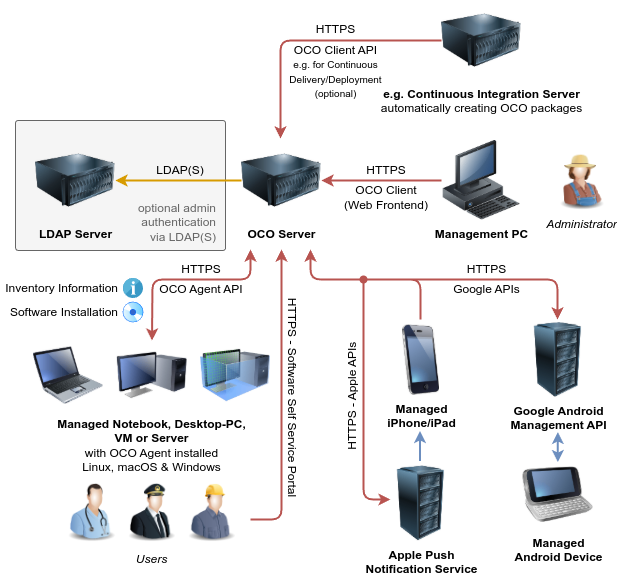
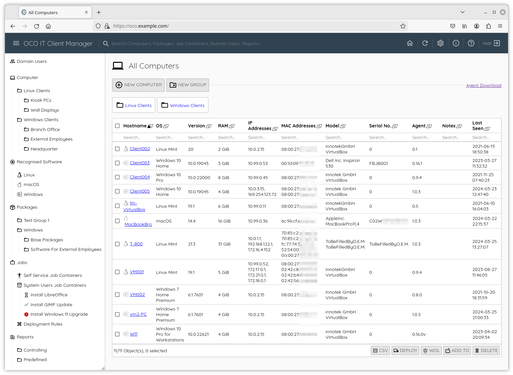
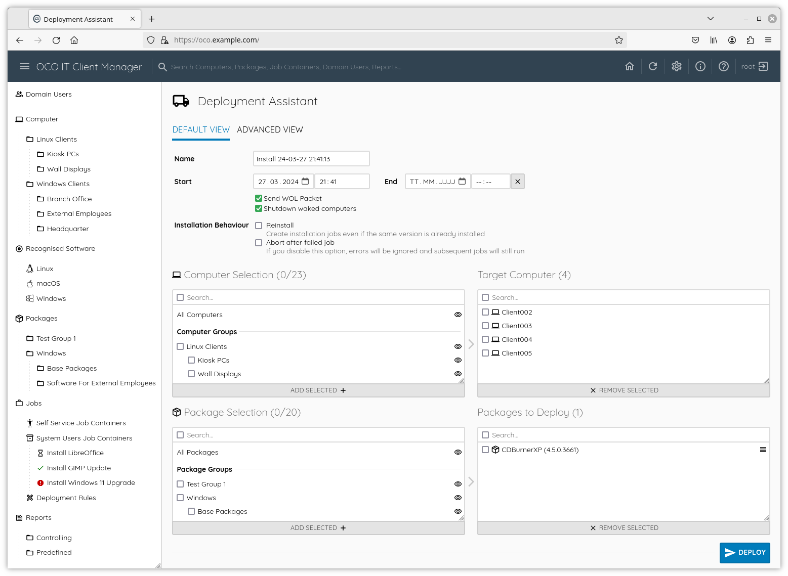

# Open Computer Orchestration
**Desktop and Server Inventory, Management & Software Deployment**

The Open Computer Orchestration (OCO) project enables IT administrators to centrally manage Linux, macOS and Windows machines using a comfortable web interface. Additionally, it provides software deployment features and a user logon overview. It focuses on easy usability (GUI) and simplicity.

- [OCO Server](https://github.com/schorschii/oco-server)
- [OCO Agent](https://github.com/schorschii/oco-agent)

## About OCO Server
The OCO server provides the Agent API (used to communicate with the OCO agent), the [Client API](docs/Client-API.md) (can be used by admins to automate workflows) and the admin web frontend for the OCO project. On the web frontend you can view computer details and configure software deployment jobs. It can be installed on any Linux distribution. Data is stored in a MySQL database.



### Screenshots




## System Requirements
### Server
- Linux Server
- MySQL Database Server
- Apache2 Web Server with PHP 7.0 or newer

### Client
- Chromium-based Web Browser (Chrome/Chromium v80 or newer, Opera etc.)
- Firefox (v80 or newer)
- (optional) OCO Client Extensions (for opening RDP, VNC, SSH sessions from the web interface)

### Agent
- please refer to [OCO Agent](https://github.com/schorschii/oco-agent)

## Installation
0. Install PHP 7.x and a web sever of your choice.
1. Download the [latest release](https://github.com/schorschii/oco-server/releases), copy all files into `/var/www/oco` and configure your web sever to use the `frontend` directory as webroot.
1. Import the database schema (`lib/sql/oco.sql`) into an empty database.
2. Enter your MySQL credentials in `conf.php` (create this file by copying the template `conf.example.php`). Please create a separate user for the database which only has permission to read and write in this specific database. Do not use the root account.
3. Make sure the defined package path is writeable for the webserver user.
4. Important: please set up HTTPS with a valid certificate and configure your web server to redirect any HTTP request to HTTPS. It is very insecure to let the agent communicate via HTTP with your server because a man-in-the-middle attack can be used to send and install any software packages to your client!!!
5. Adjust your PHP config (`/etc/php/7.x/apache2/php.ini`) to allow uploading packages of larger size (pick a value that fit your needs for the settings `upload_max_filesize`, `post_max_size` and `max_execution_time`).
6. Use a web browser to open the web frontend. The setup page should appear which guides you through the rest of the installation process.
7. Set up a cron job executing `lib/HouseKeeping.php` every 10 minutes as webserver user (`www-data`).

```
*/10 *  * * *  www-data  cd /var/www/oco/lib && php HouseKeeping.php
```

### LDAP Sync & Authentication
If you want to use LDAP to authenticate admin users on the web frontend, please follow this steps.
1. Enter your LDAP details in `conf.php`. Please read the comments in the example config file for more information.
2. Set up a cron job executing `lib/LdapSync.php` every 30 minutes as webserver user (`www-data`).

```
*/10 *  * * *  www-data  cd /var/www/oco/lib && php LdapSync.php
```

3. Start the first sync manually by executing `cd /var/www/oco/lib && php LdapSync.php`. Now you can log in with the synced accounts on the web frontend.

## More Information
**Please read the documentation in the `/docs` folder.**

## Specific Adjustments
You need specific adjustments for your environment? You can hire me to extend OCO to your needs or to write custom reports etc. Please [contact me](https://georg-sieber.de/?page=impressum) if you are interested.
