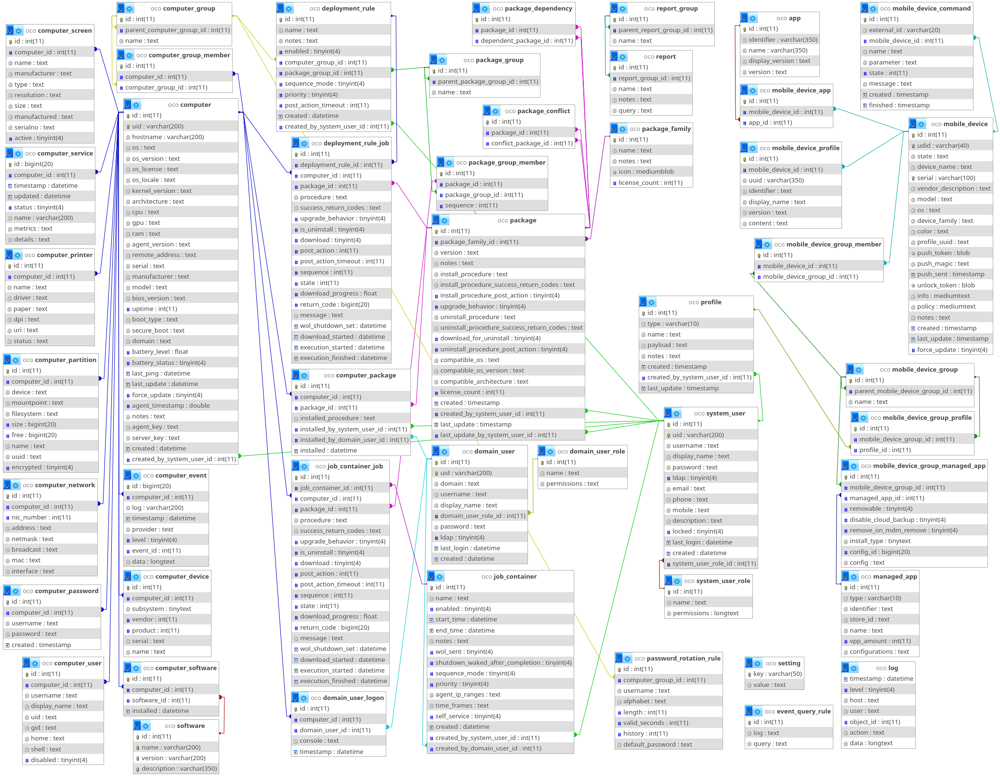

# OCO: Reports
The OCO web frontend allows you to view reports which are basically individual views for the database.

OCO comes with a hand full of sample reports which you could use to copy and modify to fit your company-specific needs.

## Linking Objects
If your report contains one or more of the following special columns, it will be automatically displayed as a link, so you can navigate to the target object with one click on the web frontend: `computer_id`, `package_id`, `software_id`, `domain_user_id`, `job_container_id`, `mobile_device_id`, `app_id`

## Security Note
Only a small group of administrators should have permission to create new reports, as by creating a report, you can display every (sensitive) information you like from the database. This means that every user which has this permission can e.g. display the settings table, the agent/server key and passwords of your managed computers!

## Database Schema
Have a look at the database schema image to create own reports.

