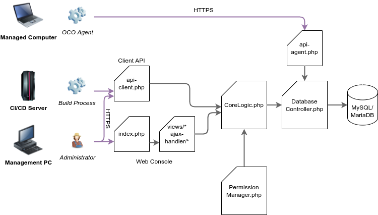

# WebApp Architecture
- The web client and client API both uses CoreLogic class for performing operations. The CoreLogic class implements input checks (e.g. that hostnames cannot be empty when creating/editing a computer) and consults the PermissionManager to check wether the user is allowed to do the requested action. If all checks passed, CoreLogic calls the appropriate function in DatabaseController for storing the information into the database and creates log entries.
- The agent API directly implements the necessary input and permission checks for the agent requests and then calls the appropriate functions in DatabaseController.

